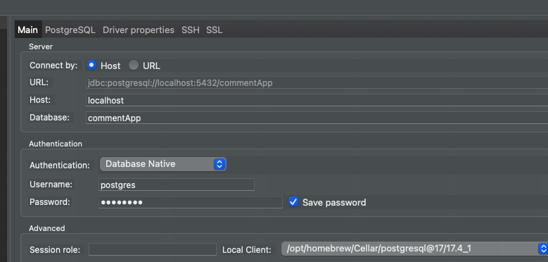
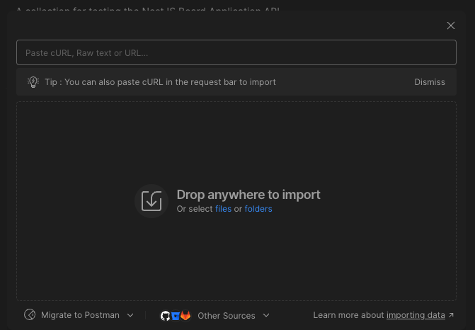
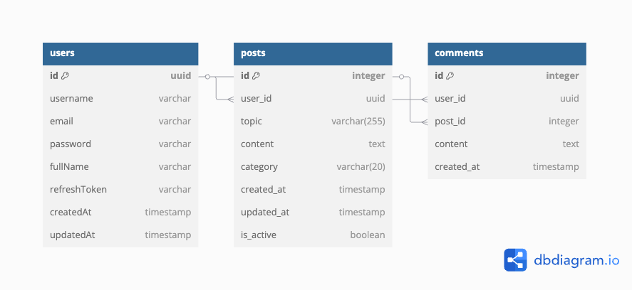

## 1.วิธีใช้งานรันโปรแกรม
```
เนื่องจากเป็น app ทดสอบ ผมจึง up.env ไปให้ได้ ของจริงไม่ควรอัพ
```

### Swagger document
```
http://localhost:8000/api/docs
```

#### 1.1 ลง PostgreSQL Server และ Driver   อย่าลืม password ตอนติดตั้ง
https://www.postgresql.org/download/


#### 1.2 ลง DBeaver เพื่อ สร้าง database ชื่อ commentApp

#### 1.3 ต่อ DBeaver แล้วสร้าง db เลือก PostgreSQL และ กรอก user,password



## 2.การ ร้น โปรแกรม

#### 2.1 ลง library
```
npm i
```

#### 2,2 สร้าง Table,Column ต่างๆจาก Prisma(Code first/Schema First) เนื่องจาก เราขึ้นโปรเจคใหม่และไม่มี DB เดิม

#### 2.2.1 สร้าง Database Migration
```
npm run migrate:dev
```

#### 2.2.2 Schema Synchronization หรือ Schema Push เพื่อปรับปรุง DB ให้ตรงกับ schema
```
npm run migrate:dev
```

#### 2.3 run program  โปรแกรม รันที่ (http://localhost:8000)
```
npm run start:dev
```

#### 2.4 ผมได้ทำ link สำหรับ import เข้า post man โดยวางลิงค์ตามรูป
```

```


## Db Diagram



## Defined Convention

### 1.Modules
#### 1.1 แยก module ตาม domain เช่น auth, users
#### 2.2 แต่ละ module ประกอบด้วย
```
- Controller
- Service
- Dto (Model ทั่วไป เช่น ทำ model ขอ body)
- Entity (Model ของ db)
```


### 2.Common
```
1.Decorators ใช้เพื่อ เพิ่ม Metadata. เช่น @GetUser()
2.Filters ใช้เพื่อจัดการ Excetions ทั้ง app 
3.Guards ใช้เพื่อกันการเช้าถึง route. เช่น JWTGuards ที่ต้องมี token ก่อน
4.Interceptors ใช้ ตรวจสอบ หรือ เพิ่มข้อมูล ก่อนหรือหลัง Request/Response
5.Interfaces กำหนดโครงสร้างข้อมูล
6.Utils  function ช่วยต่างๆ
```

### 3.Configuration
```
1.ใช้เพื่อ ดำหนดและ setting App และดึงค่า .env มาใช้
```

### 4.Prima
```
1.กำหนด migration
2.กำหนด data base schema
```

### 5.Env เพื่อ กำหนด config ต่างๆ